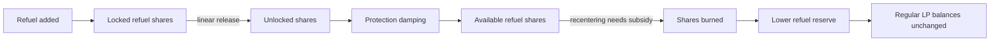

# Refuels and Automation

A refuel is liquidity added to a finite rebalancing buffer without giving the provider a withdrawable LP position. The pool records the resulting shares in `donation_shares`, unlocks them over time, and burns the available portion as it subsidizes price-scale recentering. This is why **refuel** is the product term: the buffer is supplied for a specific job and can be depleted as the pool performs that job.

:::info[Product term and contract term]

Use **refuel** in interfaces and explanations. The immutable deployed ABI uses the earlier `donation_*` names, the `Donation` event, and a `donation` flag; those names appear here only when documenting the contract.

:::

## Why a protocol refuels

A refuel is a spendable liquidity budget, not recoverable principal. The provider receives no LP balance or direct claim on the tokens. Instead, the pool uses the buffer to help pay for recentering, which can support tighter execution and routing as the external market price moves.

The economic benefit is indirect and not guaranteed: better-centered liquidity may attract more volume or improve the market for the provider's asset, while the refuel balance can decline to zero. Protocol teams should therefore model refuels as an operating cost, monitor their rate of depletion, and choose a schedule they can sustain.

Use [Mechanism and Parameter Design](./mechanism.md) to evaluate refuel demand together with concentration, fees, oracle smoothing, volatility, and external market depth.

## Refuel lifecycle



## Add a refuel

Call the four-argument overload:

```solidity
add_liquidity(
    uint256[2] amounts,
    uint256 min_mint_amount,
    address receiver,
    bool donation
) external returns (uint256 minted_shares);
```

Set `donation = true` and `receiver = address(0)`. The pool pulls both tokens from the caller, so approve each non-zero token amount first. At least one amount must be non-zero.

The return value is the number of refuel shares created. Those shares increase `totalSupply()` and `donation_shares()` but are not assigned to an address. `user_supply()` returns:

```text
totalSupply() - donation_shares()
```

Use a meaningful `min_mint_amount`; a refuel is still exposed to pool-state changes before inclusion. This path charges the contract's minimal noise fee rather than the ordinary imbalance fee.

## Unlock lifecycle

New shares begin locked and release linearly over `donation_duration()` seconds. The contract records the release schedule with `last_donation_release_ts()`.

When a second refuel arrives before the first has fully unlocked, the pool first accounts for the already released portion, adds the new shares to the remaining locked balance, and starts the combined remainder on a new linear schedule. A new refuel does not relock shares that were already released.

There is no public getter for the exact internal “available now” bucket. Consumers should display the public schedule and protection state without pretending that `donation_shares()` is immediately burnable.

## Protection damping

Liquidity additions can open or extend a protection window. During that window, the amount of unlocked refuel liquidity available to recentering is damped. This reduces the value of depositing liquidity immediately before a state change and extracting the refuel subsidy.

Read these values from each pool:

| Getter | Unit | Meaning |
| --- | --- | --- |
| `donation_protection_expiry_ts()` | Unix seconds | End of the active protection window |
| `donation_protection_period()` | seconds | Configured window length |
| `donation_protection_lp_threshold()` | 1e18 ratio | LP-addition threshold used by protection |
| `donation_shares_max_ratio()` | 1e18 ratio | Maximum refuel-share ratio |

These are governance parameters, not universal constants. For example, reviewed live pools used different protection periods and thresholds while both used a seven-day refuel duration.

## Recentering and burn priority

State-changing pool operations may update the oracle and attempt to move `price_scale` toward it. When a move would otherwise reduce LP virtual price:

1. the pool determines how many refuel shares are unlocked and available after protection;
2. available refuel shares are burned first;
3. the ordinary profit buffer covers any remaining permitted cost;
4. the recentering step is limited by configured profit and adjustment parameters.

Burning decreases both `donation_shares()` and `totalSupply()`. It does not debit an LP's `balanceOf`. Refuels subsidize recentering; they do not guarantee a fixed price, a specific rebalance time, or loss-free LP returns.

## Caps and failure conditions

A refuel reverts when:

- neither token amount is positive;
- token transfer/allowance fails;
- the minted refuel shares would exceed `donation_shares_max_ratio`;
- the result is below `min_mint_amount`;
- coin indices, receiver, or other inputs violate the deployed method's guards.

Admin setters additionally require factory-admin authorization. Duration, period, threshold, and maximum-share ratio must be positive; `admin_fee` cannot exceed the contract maximum.

## Inspect refuel state

```ts
const refuelAbi = parseAbi([
  'function donation_shares() view returns (uint256)',
  'function user_supply() view returns (uint256)',
  'function totalSupply() view returns (uint256)',
  'function donation_duration() view returns (uint256)',
  'function last_donation_release_ts() view returns (uint256)',
  'function donation_protection_expiry_ts() view returns (uint256)',
  'function donation_protection_period() view returns (uint256)',
  'function donation_protection_lp_threshold() view returns (uint256)',
  'function donation_shares_max_ratio() view returns (uint256)',
])
```

Label `donation_shares` as **refuel shares**, not token value. Convert it to a value only with a clearly stated valuation method and block number.

## Automate recurring refuels

Protocols can deposit directly on their own schedule or use the permissionless automation contracts:

- [DonationStreamer](./donation-streamer.md) escrows token amounts and executor rewards, then releases equal scheduled refuels.
- [StreamExecutor](./stream-executor.md) batches due streams for keeper-style execution.

Automation adds its own token approvals, schedule, cancellation, and executor-reward considerations. It does not bypass the pool's refuel cap, unlock schedule, or protection rules.
