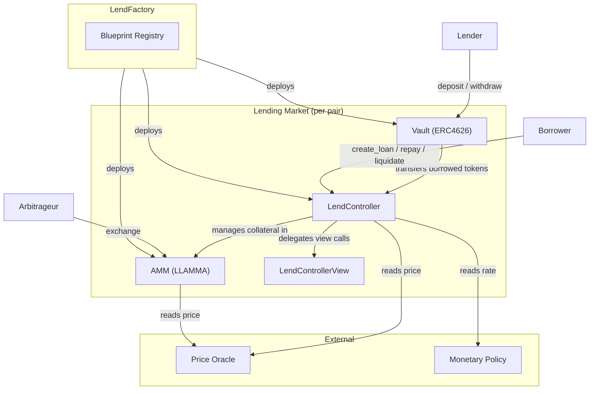

import DocCard, { DocCardGrid } from '@site/src/components/DocCard'

# Llamalend v2: Overview

Llamalend v2 is a major refactor of Curve's lending infrastructure, built on the same [`curve-stablecoin`](https://github.com/curvefi/curve-stablecoin) codebase that powers crvUSD. The system enables **permissionless one-way lending markets** where lenders deposit assets into ERC4626 vaults and borrowers take loans against collateral — with **LLAMMA-based liquidations protection** in order to protect borrowers from instant liquidation.

v2 rewrites the core contracts in **Vyper 0.4.3**, leveraging its new **module system** to share loan logic between crvUSD mint markets and lending markets without code duplication.

:::github[GitHub]

Source code is available on [GitHub](https://github.com/curvefi/curve-stablecoin). Deployment addresses will be added once contracts are finalized and deployed.

:::

---

## Architecture

Each lending market consists of three contracts deployed as a triplet by the **LendFactory**:

The [LendFactory](./lend-factory.md) deploys new markets from blueprint contracts. Each market gets its own [Vault](./vault.md), [LendController](./lend-controller.md), and [AMM](./amm.md) instance, fully isolated from other markets.

**Lenders** deposit the borrowed token (e.g., USDC, WETH) into the Vault — an ERC4626 vault that earns yield from borrower interest. The vault's `pricePerShare` increases over time as interest accrues.

**Borrowers** interact with the LendController to create loans, add/remove collateral, borrow more, or repay. The controller enforces borrow caps and manages the debt accounting.

**Collateral** is held in the AMM (LLAMMA), distributed across price bands. As the collateral price drops toward the liquidation range, the AMM gradually converts collateral to the borrowed token — this is **soft liquidation**. If the price recovers, the conversion reverses (**de-liquidation**). If a borrower's health drops below zero, anyone can call `liquidate()` on the controller to close the position.

The [LendControllerView](./lend-controller-view.md) is a stateless helper that computes health previews, max borrowable amounts (respecting borrow caps), and other read-only calculations.

---

## New Features

- **Any token as borrowed asset** — crvUSD is no longer the only allowed borrowable token. Any ERC20-compliant token can be used to create a lending market.
- **Admin fees on lending markets** — in v1, admin fees on lending markets were hardcoded to zero — all interest went to vault depositors. v2 makes them configurable per market via `set_admin_percentage()`, up to a maximum of 50%. The fee is not set automatically; it must be explicitly configured by the DAO for each market. This works well in combination with the default borrow cap of zero: the DAO can ensure any new market has an appropriate admin fee before activating it. The fee receiver is also configurable per market via the factory, which opens up the possibility for the DAO to direct admin fees to different recipients — for example, splitting revenue between the DAO and asset issuers or market curators.
- **Exit soft liquidation via repay** — calling `repay()` with `shrink=True` allows users to exit soft-liquidation by cutting the converted part of their position. `tokens_to_shrink()` indicates how many additional borrowed tokens are required (can be 0).
- **Per-operation health previews** — dedicated preview functions (`create_loan_health_preview`, `borrow_more_health_preview`, `add_collateral_health_preview`, `remove_collateral_health_preview`, `repay_health_preview`, `liquidate_health_preview`) replace the single `health_calculator()` from v1.
- **Merged extended methods** — all `*_extended` functions (e.g., `create_loan_extended`) have been merged into their base counterparts using Vyper keyword arguments, simplifying the ABI.

---

## Security Improvements

- **Vault balance accounting** — the ERC4626 Vault's internal accounting has been reworked. In v1, the balance value could be inflated, enabling the exploit vector behind the Resupply hack. The new accounting prevents this and makes it easier to build protocols on top of Llamalend.
- **Borrow caps** — per-market `borrow_cap`, adjustable by the DAO via `set_borrow_cap()`. Defaults to zero, meaning market creation requires a DAO vote to activate — ensuring proper review before a market can accept borrowers.
- **Supply caps** — per-vault deposit limits (`max_supply`), configurable by the DAO. Limits the total assets that can be deposited by lenders, capping the market's exposure on both the lending and borrowing side.
- **Settable price oracle** — in v1, the price oracle was fixed at deployment, leading people to build proxy contracts as workarounds. v2 enshrines oracle upgradability at the protocol level with `set_price_oracle()` (DAO-gated).
- **Pausable factory** — the LendFactory can be paused via Snekmate's `pausable` module, preventing new market creation in emergencies while existing markets continue to operate normally.
- **NonReentrancy by default** — the Vyper 0.4.2 compiler flag `# pragma nonreentrancy on` makes all methods and public getters nonreentrant by default, removing the risk of forgetting a `@nonreentrant` decorator.
- **Reduced code duplication** — the shared `controller.vy` module replaces the duplicated ~2k+ LOC controller, eliminating divergence bugs between lending and mint market controllers.

---

## Vyper Module System

The biggest architectural change from v1. Previously, `Controller.vy` was a monolithic 2k+ LOC contract duplicated across crvUSD and lending with manual modifications. In v2, the contracts leverage Vyper 0.4.3's [module system](https://docs.vyperlang.org/en/latest/using-modules.html), which finally allows code reuse without duplication:

- **`controller.vy`**: A Vyper module containing all core loan logic: debt tracking, health calculations, liquidation, fee collection, and rate accrual. The Llamalend market controllers are just a relatively small contract built on top of this module.
- **`LendController.vy`**: Declares `initializes: core` and `exports` the module's functions, making them part of its own external interface. It overrides virtual methods like `_on_debt_increased` to enforce borrow caps, and adds lending-specific state (vault, available balance).
- **`MintController.vy`**: For crvUSD — does the same but overrides virtual methods for minting/burning logic instead.

This pattern means both systems share identical core logic with zero code duplication. Bug fixes to `controller.vy` automatically apply to both. The same approach is used throughout: `constants.vy` is a shared constants module, `blueprint_registry.vy` is a module imported by `LendFactory`, and external packages like [Snekmate](https://github.com/pcaversaccio/snekmate) (`ownable`, `pausable`) and `curve_std` (`token`, `math`, `ema`) are imported as modules.

The upgrade to Vyper 0.4.3 also brings all recent compiler bug fixes shipped since 0.3.10.

### Blueprint Registry

v1's factory stored blueprint addresses directly. v2 introduces a `blueprint_registry` module — a whitelisted registry mapping string IDs (e.g., `"amm"`, `"ctrl"`, `"vault"`) to blueprint addresses, making blueprint management more structured.

### Shared Constants

Protocol-wide constants (version, tick limits, dead shares, WAD) are centralized in `constants.vy` and imported by all contracts, replacing scattered magic numbers.

---

## Audits

:::warning

Audits are currently in progress and have not been publicly released yet. This section will be updated with links to the audit reports once they are finalized.

:::

---

## Contract Overview

<DocCardGrid>
  <DocCard title="LendFactory" icon="vyper" link="./lend-factory" linkText="LendFactory.vy">

Factory contract that **deploys new lending markets** from blueprints. Each market is a triplet of Vault + LendController + AMM. Manages the market registry, fee receivers, and pause functionality.

  </DocCard>
  <DocCard title="Vault" icon="vyper" link="./vault" linkText="Vault.vy">

**ERC4626 vault** where lenders deposit the borrowed token to earn yield. Interest accrues through rising `pricePerShare`. Supports supply caps and dead shares protection against inflation attacks.

  </DocCard>
  <DocCard title="LendController" icon="vyper" link="./lend-controller" linkText="LendController.vy">

The **borrower-facing contract** for each market. Wraps the core `controller.vy` module and adds borrow caps, vault integration, and balance tracking. Handles loan creation, repayment, liquidation, and collateral management.

  </DocCard>
  <DocCard title="LendControllerView" icon="vyper" link="./lend-controller-view" linkText="LendControllerView.vy">

**Stateless view helper** that computes cap-aware max borrowable amounts, health previews, and user state queries. Delegates most logic to the base `ControllerView`.

  </DocCard>
  <DocCard title="AMM (LLAMMA)" icon="vyper" link="./amm" linkText="AMM.vy">

The **Lending-Liquidating AMM** that holds collateral in discretized price bands. Performs soft liquidation by gradually converting collateral as prices drop, and de-liquidation when prices recover.

  </DocCard>
</DocCardGrid>
